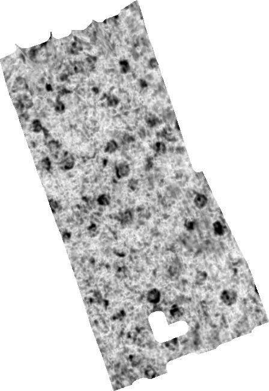

# ApInsight - SampleData

## Introduction
Sample dataset for the ApInsight tool: 

The datasets provided are a minimal example of data needed for analysis with ApInsight. The datasets provided are based on motorized MALÅ MIRA surveys carried out within The Vestfold Monitoring Project (VEMOP) - Environmental factors in minimal-invasive Cultural Heritage Management research project funded by the Oslofjordfund / Norwegian Research Council

Briefly introduce your dataset here. Explain what the data represents, the context, and how it can be useful for users who want to explore the features of your software.

## Contents
- 'C_10062021.fld': Processed 3D datablock from the GPR survey at Lunde on 10.06.2021
 - 'C_10062021_DTM_Float.tif': Digital terrain model derived from the GNNS data from the same survey
- 'C_10062021_DTMfromGPR.fld': Topographically correced 3D datablock from the same survey

- 'E_31082021.fld': Processed 3D datablock from the GPR survey at Lunde on 31.08.2021
- 'E_31082021_DTM_Float.tif': Digital terrain model derived from the GNNS data from the same survey

## Prerequisites
- ApInsight: Follow the download, installation and setup instructions here: https://github.com/erichnau/GPR_tools/tree/new_GUI

## License
The datasets are released under the [MIT]. See the LICENSE file for more details.
## Acknowlegements
The datasets were kindly provided by Petra Schneidhofer, Kulturarv, Vestfold fylkeskommune (petra.schneidhofer@vestfoldfylke.no)

## Contact
erich.nau@niku.no
